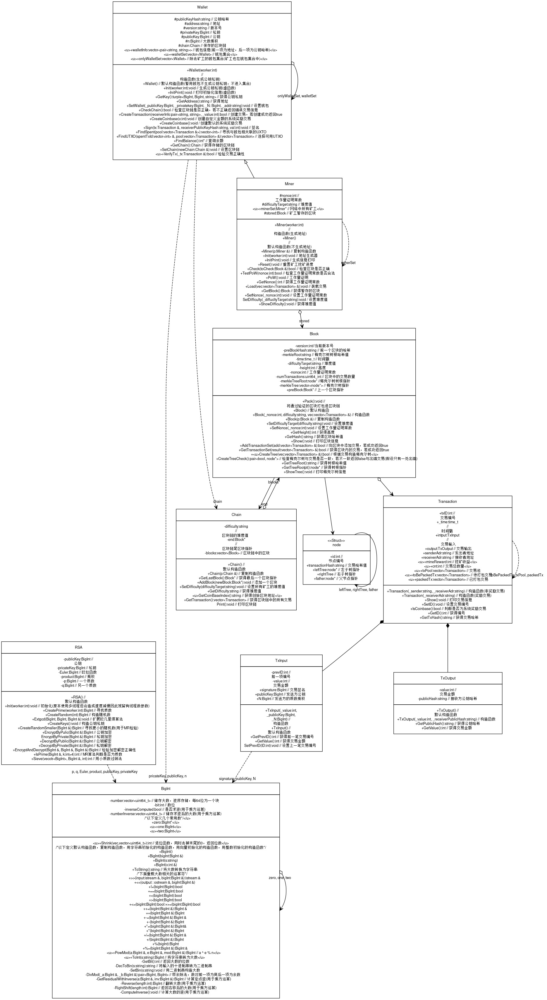

# 设计说明书

[TOC]

## 类设计

### 类功能说明

1. BigInt类：大数类，实现任意大正整数的运算
2. RSA类：实现加密解密功能
3. （哈希函数类提供公共接口）
4. Wallet类：钱包类，实现交易等功能
5. Miner类：矿工类，继承钱包，实现挖矿等功能
6. Block类：区块类，记录区块头区块体信息
7. Chain类：区块链类，链表储存区块
8. Transaction类：交易类，记录交易信息
9. txInput类：记录交易输入信息
10. txOutput类：记录交易输出信息

### 类图

- svg/jpg图请参考[这里](https://github.com/TeamFromNFLS/BlockChain/tree/master/Doc/UML)




## 技术难点 & 算法设计

### 加密算法

#### RSA

##### 大数类

* （参考项目 https://github.com/thuliangjz/rsa-DIY）

###### 技术难点

1. 如何存储长整数
2. 如何加速大整数乘方运算

###### 算法设计

1. 2^64 进制存储数据，减少位数

2. 加减乘法汇编加速，一次可以处理多位数字与进位溢出问题

   - 理论上处理器支持 128 位寄存器，可以进一步扩大进制

   - 加法每次即每次从寄存器 `EFLAGS` 中读取上一次相加所得进位，用 `adc` 指令将数和上一次进位 `CF` 相加，保存进位增加索引进入下一轮相加，核心代码如下：

   

``` asm
    sahf;
    movq (%%r8, %%rcx, 8), %%rax;
    movq (%%r9, %%rcx, 8), %%rbx;
    adc %%rax, %%rbx;
    lahf;
    movq %%rbx, (%%r10, %%rcx, 8);
```

   - 减法即将 `adc` 改为 `sub` 即可

   - 乘法模拟竖式，先将一个乘数中的某一个整型乘以另一个大整数，移位后加到最终结果上。第一步代码如下：

   

``` asm
    mov %%r8, %%rax;	//小乘数保存在r8中
    mov (%%rsi, %%rcx, 8), %%rbx;	//取出大乘数
    mul %%rbx;
    mov %%rax, %%rbx;
    ASM_RESTORE
    adc %%r14, %%rbx;	//本轮结果即本次乘法+上次乘法溢出+上次加法溢出
    ASM_LOAD
    mov %%rdx, %%r14;	//mul指令溢出保存在r14中
    mov %%rbx, (%%rdi, %%rcx, 8);
```

   - 除法为长除法。这里实现的实际上是基于二进制的整形除法，每次确定商的一个比特位。长除法中的乘法全部被移位所替代，因为每次除数需要乘的都是 2 的幂次，这在一定程度上加快了除法的速度

3. 快速幂借助 Newton-Raphson 算法，用乘法和加减法代替除法。用定点数存储，以调用之前的整数运算实现小数运算

   - 精度问题在原项目中有详细分析，摘抄如下

     - 关于定点数的精度，对于计算 $a^b \pmod{n}$，在使用快速幂算法进行迭代计算的过程中，每一步实际上都是对于某个$x \le n$计算$x^2 \pmod n$，所以实际上被除数不大于$n^2$。如果$n$有$p$位，则$n^2$不超过$2p$位，从而对于这样的$x^2$，逆的精度只要精确到小数点后$2p$位即误差不超过$2^{-2p}$即可保证与被除数相乘与商的误差不超过 1。
     - 注意到如果将$\lfloor \frac 1n \times x \rfloor $作为商，即使误差本身不超过 1，向下取整之后可能会达到 1（向下取整在这里实现为移位运算），从而按上述方法计算的结果可能需要减去 n 才能得到真正比 n 小的余数。

##### 验证质数

###### 技术难点

1. 如何快速检测大数是否为质数

###### 算法设计

1. 采用方案：Miller-Rabin 检测（伪代码）

   Miller-Rabin 素性检验是一个基于概率的检验方案，与费马素性检验相比条件更强，更不易出现类似 Carmichael 数一类的漏网之鱼；而 AKS 素性检验可以确定地判断给定数字是否为素数，但是速度相较 Miller-Rabin 更慢。

   该素性检验的主要思想为：

   待检验的数为 $n$ （$n$为奇数）， 将 $n-1$ 分解为 $2^r \cdot d$, 其中 $d$ 为奇数。若$\exists \; a \in [2, n-2], \; a\in \mathrm{N}\; s.t.\forall 0 \leq s \leq r-1, \; a^d \not\equiv 1(mod\; n)\; \text{且}\; a^{2^sd} \not\equiv n-1(mod \; n), $则$n$为合数。通过$k$轮检验($i.e.\; k$ 次随机选取$a$)。以下为该检验方法的伪代码：

   write $n-1$ as $2^r \cdot d$ by factoring powers of $2$ from $n-1$

   Loop: repeat $k$ times:

    	pick a random integer $a\in [2, n-2]$

    	$x \leftarrow\;a^d \; mod\; n$

    	if $x = 1$ then

    		continue Loop

    	repeat $r$ times:

    		if $x = n-1$ then

    			continue Loop

    		$x \leftarrow\; x^2\;mod\;n$

   ​	 return composite
   
   return probably prime

参考密码学资料以及 Java 的 RSA 库，为了平衡效率和正确率，1024 位 RSA 将选取$k=4$.

##### RSA 实现

* RSA 生成公私钥的步骤如下

  1. 任选两个 512 位素数$p, q$, 计算其积为$N$
  2. 计算欧拉数$\varphi = (p-1)\cdot (q-1)$
  3. 任选 $e$ 满足 $1<e<\varphi$ 且 $gcd(e, \varphi) = 1$, $(e, N)$即为公钥。实际应用中 $e$ 大多选择 $3$ 或 65537
  4. 任选 $d$ 满足 $1<d<\varphi$ 且 $e\cdot d \equiv 1(mod\; \varphi)$, $( d, N)$即为私钥。

  在步骤 a. 中，为了加快素数生成速度，先随机生成一个奇数 $n$, 取以 $n$ 为首项的 1000 个连续奇数，用小于 10000 的素数筛一遍，剩下的数用 Miller-Rabin 素性检验进行检测，如果不存在素数，则重复上述过程。

  在步骤 d. 中，采用扩展欧几里得算法计算 $d\; mod \; N$ 的逆元。

* RSA 加解密

  + 公钥加密，私钥解密

    $\text{密文} = \text{明文}^e \; mod \; N$

    $\text{明文} = \text{密文}^d\;mod\;N$

  + 私钥加密，公钥解密（用于交易中的数字签名及验证，详细介绍见后文）

    $\text{密文} = \text{明文}^d \; mod \; N$

    $\text{明文} = \text{密文}^e\;mod\;N$

### p2p 网络

#### 技术难点

1. 如何单机模拟网络操作

#### 算法设计

1. 手动添加节点并模拟复制区块链等过程（通过多线程加速多个节点生成速度）
2. 通过复制的方式模拟广播过程
3. 多线程模拟多个矿工挖矿过程
4. 设计输出日志以记录各种信息

### 交互

#### 技术难点

1. 如何实现与用户的高效交互

#### 算法设计

1. 模仿gdb设计命令行交互
2. 提供help指令降低用户学习成本
3. 通过最短编辑距离实现错误输入智能纠正
4. 逐个字符输出，借助[cool-retro-term](https://github.com/Swordfish90/cool-retro-term),仿佛重回IBM 3270, Apple 2的年代（